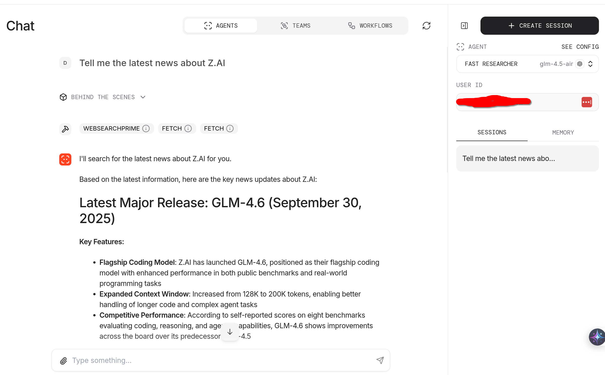
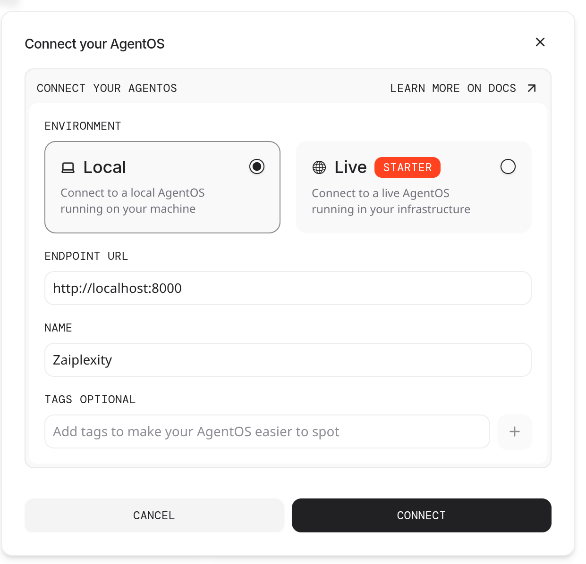

# Zaiplexity

A Perplexity-like AI research assistant built with Agno and AgnoOS, leveraging Z.ai's GLM language models and web search capabilities for subscribers of the Z.ai Pro coding plan.

## Overview

Zaiplexity is a multi-agent AI research system that provides intelligent web research capabilities through three specialized agents:

- **Deep Researcher**: Thorough, comprehensive research using GLM-4.6
- **Fast Researcher**: Quick, accurate responses using GLM-4.5-air
- **Visual Researcher**: Image analysis and insights using GLM-4.5v



## Features

- **Multi-Agent Architecture**: Specialized agents for different research needs
- **Web Search Integration**: Powered by Z.ai's web search API
- **Page Content Fetching**: Comprehensive web page analysis
- **Memory & Context Management**: Session summaries, user memories, and conversation history
- **SQLite Database**: Persistent storage for sessions, metrics, and memories
- **REST API**: FastAPI-based web interface serving on port 8000

## Architecture

### Agents

1. **Deep Researcher** (`glm-4.6`)
   - Comprehensive research with up to 6 search queries per request
   - Ideal for in-depth analysis and detailed investigations

2. **Fast Researcher** (`glm-4.5-air`)
   - Quick responses with up to 3 search queries per request
   - Optimized for rapid information retrieval

3. **Visual Researcher** (`glm-4.5v`)
   - Image analysis and visual content understanding
   - Detailed insights about objects, people, scenes, and text in images

### Technology Stack

- **Framework**: Agno & AgnoOS
- **Language Models**: Z.ai GLM family (4.6, 4.5-air, 4.5v)
- **Web Framework**: FastAPI
- **Database**: SQLite
- **Tools**: MCP (Model Context Protocol) for search and page fetching

## Installation

### Prerequisites

- Python 3.8+
- Z.ai Pro coding plan subscription
- Z.ai API key

### Setup

1. **Clone the repository**:
   ```bash
   git clone <repository-url>
   cd zaiplexity
   ```

2. **Install dependencies**:
   ```bash
   pip install -r requirements.txt
   ```

3. **Set environment variables**:
   ```bash
   export ZAI_API_KEY="your-zai-api-key"
   # Optional: Use China endpoint
   export ZAI_CHINA_ENDPOINT="true"  # Set to 'true' for China endpoint
   ```

## Usage

### Running the Application

```bash
python zaiplexity.py
```

The application will start on `http://localhost:8000` with auto-reload enabled.

### Adding to AgnoOS Control Plane

To integrate Zaiplexity with the AgnoOS control plane:

1. **Navigate to AgnoOS**: Go to https://os.agno.com/
2. **Add AgentOS**: Click the "Add AgentOS" button
3. **Configure Connection**:
   - **Endpoint URL**: `http://localhost:8000`
   - **Name**: `Zaiplexity`
4. **Connect**: Click "Connect" to complete the integration



This will register your Zaiplexity instance with the AgnoOS control plane, allowing you to interact and monitor it through the web interface.

### Configuration

#### Environment Variables

- `ZAI_API_KEY`: Your Z.ai API key (required)
- `ZAI_CHINA_ENDPOINT`: Set to 'true' to use China endpoints (optional)

#### Endpoints

**Default (Global)**:
- API Base URL: `https://api.z.ai/api/coding/paas/v4`
- MCP Search URL: `https://api.z.ai/api/mcp/web_search_prime/mcp`

**China Endpoint** (when `ZAI_CHINA_ENDPOINT=true`):
- API Base URL: `https://open.bigmodel.cn/api/coding/paas/v4`
- MCP Search URL: `https://open.bigmodel.cn/api/mcp/web_search_prime/mcp`

## Database Structure

The application uses SQLite with the following tables:
- `sessions`: Agent session data
- `eval_runs`: Evaluation runs tracking
- `user_memories`: User conversation memories
- `metrics`: Performance and usage metrics

## Agent Capabilities

### Search Limitations
- Deep Researcher: Maximum 6 search queries per request
- Fast Researcher: Maximum 3 search queries per request

### Memory Features
- Session summaries for context continuity
- User memories for personalized interactions
- Agentic memory for learning from conversations
- Conversation history (last 3 runs)
- Timestamp context awareness

## Development

### Project Structure
```
zaiplexity/
├── zaiplexity.py      # Main application file
├── requirements.txt   # Python dependencies
├── agno.db           # SQLite database (auto-created)
└── README.md         # This file
```

### Dependencies

Key dependencies include:
- `agno`: Core AI agent framework
- `fastapi`: Web framework
- `openai`: OpenAI-compatible API client
- `mcp`: Model Context Protocol tools
- `sqlalchemy`: Database ORM

## License

This project is licensed under the MIT License - see the [LICENSE](LICENSE) file for details.

## Support

For issues related to:
- **Z.ai API**: Contact Z.ai support
- **Application issues**: Check the Agno framework documentation
- **API key problems**: Verify your Z.ai Pro coding plan subscription

## Support

For issues related to:
- **Z.ai API**: Contact Z.ai support
- **Application issues**: Check the Agno framework documentation
- **API key problems**: Verify your Z.ai Pro coding plan subscription